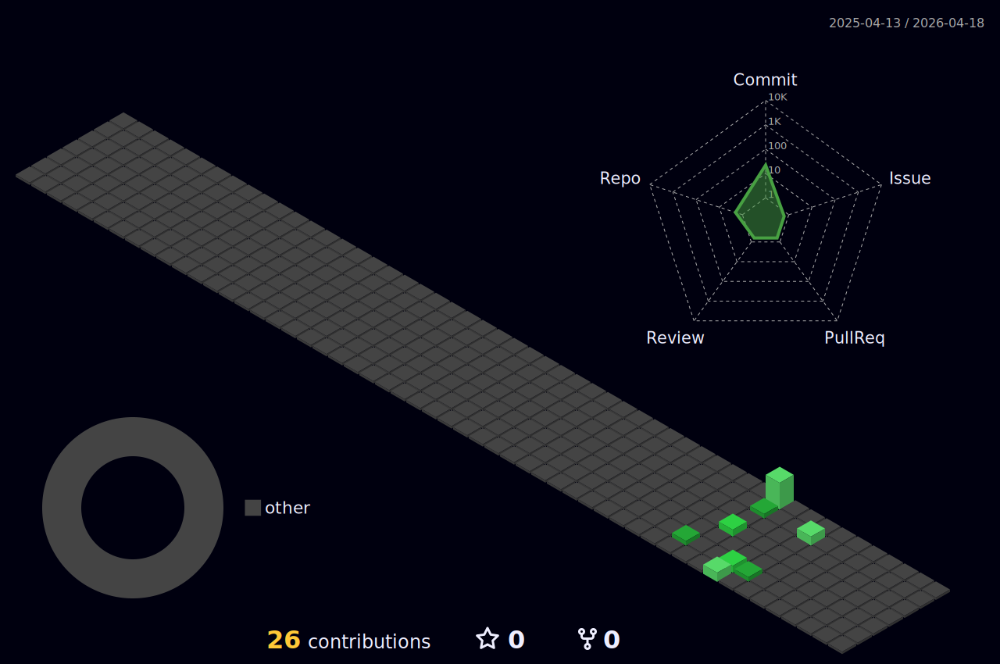

<div align="center">


</div>

<div align="center">
  
```ascii
╔══════════════════════════════════════════════════════════════════════════════════════╗
║                                                                                      ║
║   ███████╗██████╗ ███████╗███████╗███████╗██╗  ██╗ █████╗ ███╗   ██╗                ║
║   ██╔════╝██╔══██╗██╔════╝██╔════╝██╔════╝██║  ██║██╔══██╗████╗  ██║                ║
║   ███████╗██████╔╝█████╗  █████╗  ███████╗███████║███████║██╔██╗ ██║                ║
║   ╚════██║██╔══██╗██╔══╝  ██╔══╝  ╚════██║██╔══██║██╔══██║██║╚██╗██║                ║
║   ███████║██║  ██║███████╗███████╗███████║██║  ██║██║  ██║██║ ╚████║                ║
║   ╚══════╝╚═╝  ╚═╝╚══════╝╚══════╝╚══════╝╚═╝  ╚═╝╚═╝  ╚═╝╚═╝  ╚═══╝                ║
║                                                                                      ║
║                                        ██████╗ ███████╗██████╗ ██████╗ ██╗   ██╗    ║
║                                        ██╔══██╗██╔════╝██╔══██╗██╔══██╗╚██╗ ██╔╝    ║
║                                        ██████╔╝█████╗  ██║  ██║██║  ██║ ╚████╔╝     ║
║                                        ██╔══██╗██╔══╝  ██║  ██║██║  ██║  ╚██╔╝      ║
║                                        ██║  ██║███████╗██████╔╝██████╔╝   ██║       ║
║                                        ╚═╝  ╚═╝╚══════╝╚═════╝ ╚═════╝    ╚═╝       ║
║                                                                                      ║
╚══════════════════════════════════════════════════════════════════════════════════════╝
```

</div>

<p align="center">
  
</p>

<div align="center">
  


</div>

<div align="center">
  
[](https://www.linkedin.com/in/sreeshan-reddy-34064b320/)
[](mailto:sreeshanreddy26@gmail.com)
[](https://github.com/Sreeshan7)


</div>

---

## 💻 Tech Arsenal

<div align="center">

### Languages


### AI/ML & Data Science


### Frameworks & Libraries


### Tools & Technologies


</div>

---

## 🎯 Current Focus

```javascript
const sreeshan = {
    code: ["Python", "JavaScript", "TypeScript", "Java", "C++"],
    technologies: {
        frontEnd: {
            frameworks: ["React", "Next.js"],
            styling: ["TailwindCSS", "Material-UI", "Styled-Components"]
        },
        backEnd: {
            js: ["Node.js", "Express"],
            python: ["Django", "Flask", "FastAPI"]
        },
        aiMl: {
            frameworks: ["TensorFlow", "PyTorch", "Scikit-Learn", "Keras"],
            tools: ["NumPy", "Pandas", "Matplotlib", "OpenCV"],
            focus: ["Deep Learning", "Neural Networks", "Computer Vision", "NLP"]
        },
        problemSolving: {
            platforms: ["LeetCode", "Codeforces", "CodeChef", "HackerRank"],
            expertise: ["DSA", "Algorithms", "Competitive Programming"],
            specialization: ["Dynamic Programming", "Graph Theory", "Trees"]
        },
        databases: ["MongoDB", "PostgreSQL", "Redis", "MySQL"],
        devOps: ["Docker", "AWS", "CI/CD", "Linux"],
        tools: ["Git", "Jupyter", "Postman", "Webpack", "Vite"]
    },
    currentFocus: "Building AI-powered full-stack applications",
    learningNow: "Advanced Deep Learning & Transformers",
    funFact: "I train neural networks faster than I can explain them 🤖"
};
```

---

## 🧩 DSA & Problem Solving

<div align="center">


<br><br>

```cpp
while(true) {
    code();
    optimize();
    solve();
    repeat();
}
```

<br>

### 🏅 Competitive Programming


<br>

| 📚 Data Structures | ⚡ Algorithms |
|:------------------:|:-------------:|
| Arrays & Strings  | Sorting & Searching |
| Linked Lists      | Dynamic Programming |
| Trees & Graphs    | Greedy Algorithms |
| Stacks & Queues   | Backtracking |
| Heaps & Hash Maps | Graph Algorithms |

</div>

---

## 🔥 Contribution Streak

<div align="center">
  


</div>

<br>

<div align="center">
  


</div>

---

## 🏆 GitHub Trophies

<div align="center">
  


</div>

---

## 📊 Coding Activity

<div align="center">

<!--START_SECTION:waka-->
<!--END_SECTION:waka-->


</div>

---

## 💡 Featured Projects

<div align="center">

<a href="https://github.com/Sreeshan7?tab=repositories">
  
</a>

</div>

---

## 📈 Analytics

<div align="center">
  


</div>

---

<div align="center">

### 💭 Dev Quote


</div>

---

<div align="center">

## 🎮 Connect & Collaborate


**💌 Open to collaborations on AI/ML projects and innovative full-stack applications!**

</div>

---

<p align="center">
  
</p>

<div align="center">

**⚡ "Any sufficiently advanced technology is indistinguishable from magic." - Arthur C. Clarke**


</div>
